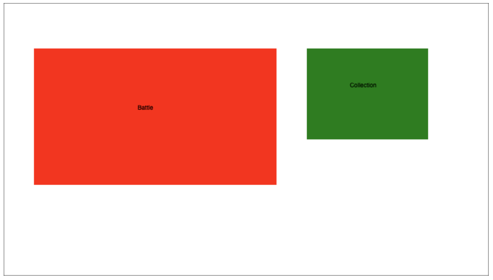

# miniverse-mayhem-dcg

This is the source code for the currently titled "Miniverse Mayhem" digital card game.

Language: Javascript
Environment: Node.js
Add-ons: Express, socket.io, browserify

How to see the current progress:

1. After installing the dependencies, navigate to the folder 'miniverse-mayhem-dcg' and run 'node server.js' from the command line.

2. Navigate to 'http://localhost:3000'. You should see a page that looks like this:

